<h1 align="center">Hi 👋, I'm Krish Sharma</h1>

<h3 align="center">
Backend & Software Engineer | Distributed Systems • Real-Time Applications • System Design
</h3>


---

### 👨‍💻 About Me

I'm a Computer Science student focused on building **scalable backend systems, distributed applications, and real-time software**.

I enjoy understanding how systems work under the hood — from **concurrency and networking to databases, caching, messaging, and system architecture**.

Alongside backend engineering, I also explore **AI/ML**, having built practical applications that integrate **machine learning, intelligent APIs, and modern software systems**.

Currently focused on:

* 🏗️ Distributed Systems & System Design
* ⚡ Real-Time Applications & WebSockets
* 🐳 Docker & Containerized Applications
* 🗄️ PostgreSQL, Redis & Database Design
* 🔄 Message Queues & Asynchronous Systems
* 🤖 AI/ML & Intelligent Applications
* 💻 Data Structures & Algorithms in C++
---
### 🚀 Featured Projects

<table>
<tr>

<td width="50%" align="center">

<h3>Distributed Job Orchestrator</h3>

<p>
  <a href="https://github.com/Krish2600/distributed-job-orchestrator">
    
  </a>
  <a href="http://jobflowkrish.duckdns.org:3000">
    
  </a>
</p>

<p>
A distributed system for submitting, scheduling and executing background jobs across multiple workers.
</p>

<p>
<b>Docker • Redis • PostgreSQL • Distributed Systems</b>
</p>

</td>

<td width="50%" align="center">

<h3>CodeCraft Studio</h3>

<p>
  <a href="https://github.com/Krish2600/codecraft-studio">
    
  </a>
  <a href="https://codecraft-nhvw.onrender.com/">
    
  </a>
</p>

<p>
A browser-based code editor designed for writing and executing code through a real-time development environment.
</p>

<p>
<b>React • Node.js • WebSockets • Backend Development</b>
</p>

</td>

</tr>
</table>

---

### 🧠 What I'm Working On

```text
System Design
     ↓
Distributed Systems
     ↓
Scalable Backend Architecture
     ↓
Real-Time Communication
     ↓
Databases • Caching • Message Queues
```

I'm currently deepening my understanding of **how production-grade systems are designed, scaled, and made reliable**.

---

### 🛠️ Tech Stack

#### 💻 Languages

<p>
  
  
  
  
  
  
</p>

#### ⚙️ Backend & Web

<p>
  
  
  
  
  
</p>

#### 🗄️ Databases & Distributed Infrastructure

<p>
  
  
  
  
  
</p>

#### 🐳 DevOps & Cloud

<p>
  
  
  
  
  
</p>

---

### 📚 Currently Learning

<p align="center">

`System Design` · `Distributed Systems` · `Docker` · `Redis` · `PostgreSQL` · `Scalable Backend Architecture`

</p>

---

### 📊 GitHub Stats

<p align="center">
  
  
</p>

---

### 🧩 LeetCode

<p align="center">
  <a href="https://leetcode.com/krish2600">
    
  </a>
</p>

### 🤝 Connect With Me

<p align="left">
  <a href="https://linkedin.com/in/krish-sharma-7301a9320/" target="_blank">
    
  </a>
  <a href="https://leetcode.com/krish2600" target="_blank">
    
  </a>
  <a href="mailto:krish.s1107@gmail.com">
    
  </a>
</p>

<p align="center">
  <i>Building systems. Solving problems. Learning how things work under the hood.</i>
</p>
